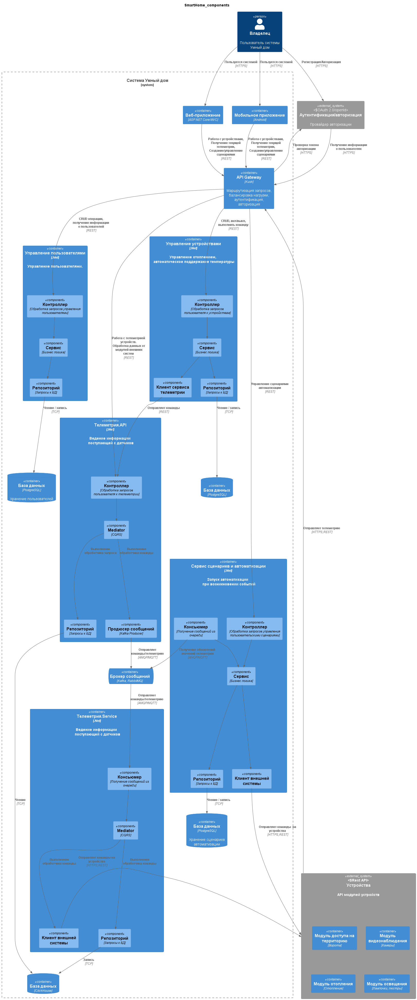
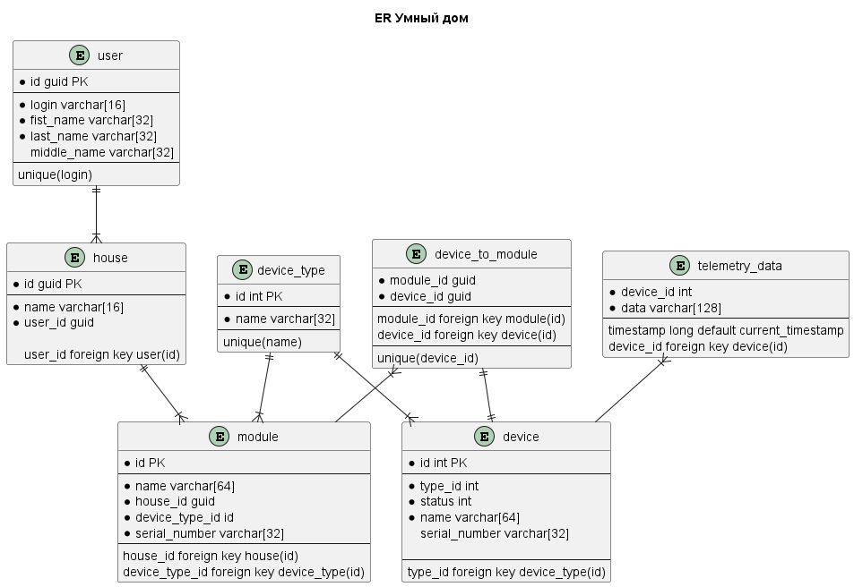

# Задание 1. Анализ и планирование

[Ссылка на исходник](/diagrams/context/Умный%20дом.puml)

**Управление отоплением:**

* Пользователи могут удалённо включать/выключать отопление в своих домах.
* Пользователи могут устанавливать желаемую температуру.
* Система автоматически поддерживает заданную температуру, регулируя подачу тепла.

**Мониторинг температуры:**

* Система получает данные о температуре с датчиков, установленных в домах.
* Пользователи могут просматривать текущую температуру в своих домах через веб-интерфейс.

**1.1 Анализ архитектуры монолитного приложения**

**Язык программирования**: Java. Популярный язык общего назначения. Много готовых решений, фреймворков. Можно создавать как небольшие приложения, так и большие системы.  

**База данных**: PostgreSQL. Реляционная БД. Соблюдает принципы ACID. Выдерживает большие нагрузки как OLAP, так и OLTP. Можно использовать плагины для тонкой настройки и расширения функционала.  

**Архитектура**: Монолитная, все компоненты системы (обработка запросов, бизнес-логика, работа с данными) находятся в рамках одного приложения.  
Минусы: 
- высокий риск ошибок (изменения в одной части приложения могут непредсказуемо влиять на другие части); 
- длительные циклы разработки и развёртывания (при каждом изменении приходится тестировать всё приложение целиком); 
- трудно масштабировать отдельные компоненты системы; 
- трудно управлять командой.  

**Взаимодействие**: Синхронное, запросы обрабатываются последовательно.  
Плюсы: 
- простота, предсказуемость, лёгкость отладки и мониторинга.  

Минусы: 
- возможны высокие задержки, увеличение зависимости между сервисами, ограниченная масштабируемость из-за блокирующих вызовов.  

**Развертывание**: Требует остановки всего приложения. Пользователи могут сталкиваться с недоступностью на время развертывания.

**1.2 Домены и границы контекстов**

**Домен: управление устройствами**
- Контекст: заведение устройств
- Контекст: включение\выключение устройства
- Контекст: изменение телеметрии устройств

**Домен: Сценарии и автоматизация**
- Контекст: автоматическое реагирование на изменение телеметрии
- Контекст: создание/редактирование/удаление сценариев автоматизации

**Домен: Управление пользователями**
- Контекст: создание/редактирование/удаление пользователей

# Задание 2. Проектирование микросервисной архитектуры

[Ссылка на исходник](/diagrams/containers/SmartHome_containers.puml)

**Декомпозиция на микросервисы**

1. **Телеметрия.API** - сервис, который принимает телеметрию от датчиков и команды на управление датчиками от внутренних сервисов. Доступ к БД на чтение. Доступ к брокеру сообщений для записи телеметрии.
2. **Телеметрия.Service** - сервис для отправки команд на датчики внешней системы. Так же сервис получает значения телеметрии с брокера сообщений и записывает их в базу данных.
3. **Управление устройствами** - микросервис, занимается ведением перечня датчиков и отвечает за выполнение команд пользователя.
4. **Управление пользователями** - микросервис, занимается ведением реестра пользователей.
5. **Сервис сценариев и автоматизации** - микросервис отвечает за создание и запуск пользовательских сценариев автоматизации.

**Взаимодействие**

1. Все запросы пользователя и внешних систем поступают в API Gateway.
2. API Gateway маршрутизирует запросы согласно роутингу микросервисам.
   При выполнении запроса происходит проверка токена авторизации пользователя/системы.
3. Команды на управления дитчиками поступают в API сервиса телеметрии и складываются в брокер сообщений. Далее команды отправляются фоновым сервисом во внешнюю систему для равномерного распределения нагрузки
4. Значения телеметрии с датчиков поступают на API Gateway и далее попадают в API сервиса телеметрии и складыватся в брокер сообщений. Далее фоновый сервис сохраняет значения телеметрии в базе данных пачкой (bulk insert) для большей производительности БД на запись.
5. Запросы получения данных телеметрии обрабатывает API сервиса телеметрии и получает данные из базы данных.
6. Пользователи системы заводятся через сервис "Управления пользователями". Сервис "Аутентификации/авторизации" получает пользователей через API Gateway, для настройки соответствующих прав доступа.
 7. В системе предусмотрено автоматическое реагирование на изменение телеметрии устройств. Соззание сценариев происходит через сервис "Сервис сценариев и автоматизации". Данный сервис получает события из брокера сообщений.
 8. Пользователь может работать как web-приложением, так и с мобильным приложением. Запросы от этих приложений попадают в API Gateway и маршрутизируются в соответствующий сервис.

**C4 — Уровень компонентов (Components)**  

[Исходник](diagrams/components/SmartHome_components.puml)

**C4 — Уровень кода (Code)**  

[Исходник](diagrams/code/TelemetryApi.puml)

# Задание 3. Разработка ER-диаграммы

[Исходник](diagrams/er/er-diagram.puml)

**Описание связей**

* **Пользователь — Дом:** один-ко-многим, один пользователь может иметь доступ к нескольким домам, но каждый дом связан только с одним пользователем.
* **Устройство — Модуль:** один-ко-многим (через кросс таблицу), к одному модулю могут быть подключены несколько устройств, но каждое устройство связано только с одним модулем.
* **Телеметрия — Устройство:** один-ко-многим, одно устройство генерирует несколько единиц данных телеметрии, но одна единица данных может быть создана только одним устройством.
* **Устройство — Тип устройства:** один-ко-многим, один тип устройства может быть у нескольких устройств.
* **Модуль — Дом:** один-ко-многим, в одном доме может быть установлено несколько модулей, но каждый модуль связан только с одним домом.
* **Модуль — Тип устройства:** один-ко-многим, один тип устройства может быть у нескольких модулей, но к одному модулю могут быть подключены устройства только одного типа.

# Задание 4. Создание и документирование API

[Исходник](api/openapi3_0.yaml)